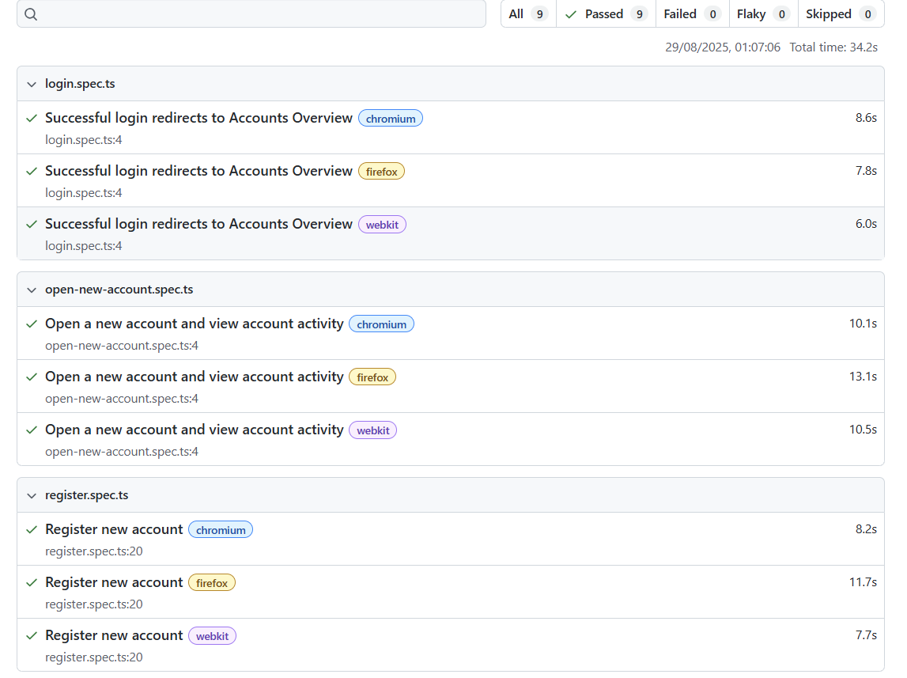

# Parabank Test Automation (Playwright)

This repository contains automated tests for the Parabank demo application, implemented using [Playwright](https://playwright.dev/).

The assessment covers three required scenarios:

1. **Register a new account** – Completing all required fields and verifying the user is logged in.
2. **Login** – Logging in with valid credentials and confirming redirection to the Accounts Overview page.
3. **Open a new account and view activity** – Creating a new account and verifying that the initial credit of $100 is received.

---

## Getting Started

```bash
# Install dependencies
npm install

# Run all tests
npx playwright test

# View the test report
npx playwright show-report
```

---

## Environment Variables

Tests can use environment variables to configure credentials.

An example is provided in .env.example:

```env
BASE_URL=https://parabank.parasoft.com
TEST_USERNAME=john
TEST_PW=demo
```

Copy this file to .env and adjust values if needed.

---

## Test Results

All tests currently pass successfully against the Parabank demo site.

Below is a screenshot of the Playwright HTML report:



---

## Assessment Considerations

- Tests are written to demonstrate correct flows and fail if functionality is broken.

- Code follows DRY principles with a reusable login helper.

- Assertions are included at key points (URL checks, headings, and table values).

- Documentation highlights demo site instability, which explains any intermittent failures.
